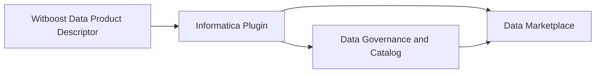

# Witboost Informatica Plugin

This repository contains an Agile Lab plugin for [Witboost](https://www.witboost.com). It translates a Witboost Data Product Descriptor into metadata managed by Informatica.

The plugin supports two complementary Informatica capabilities:

- **Data Governance and Catalog** for technical assets, their physical locations, and schema metadata.
- **Data Marketplace** for data-product discovery, delivery targets, and links to catalogued assets.

## Overview

A Witboost provisioning request supplies a Data Product Descriptor to the plugin. When publication is enabled for that descriptor, the plugin validates it, creates or reconciles the technical metadata in Data Governance and Catalog, and publishes the consumer-facing representation in Data Marketplace.



The Catalog representation is the technical foundation. Marketplace uses it to expose eligible output ports as delivery options and to reference their catalogued assets. Publication is opt-in at data-product level and can be limited by environment or disabled for individual output ports.

## Run Locally

### Prerequisites

- Java 17
- Maven 3.9 or newer
- An Informatica tenant and service account only when validating or provisioning against a live tenant

For `jenv` users:

```bash
jenv local 17
export JAVA_HOME=$(/usr/libexec/java_home -v 17)
```

### Configure

The runtime defaults are in `src/main/resources/application.yml`. Copy `.env.example` to `.env`, set the Informatica service-account credentials and any tenant-specific URLs, then load the variables into the current shell:

```bash
cp .env.example .env
set -a
source .env
set +a
```

Do not commit `.env`. The [authentication guide](docs/informatica-authentication.md) explains the required access and every connection setting.

### Build and Test

```bash
mvn verify
```

This command runs formatting checks, tests, and packaging. Format local changes with:

```bash
mvn spotless:apply
```

The ordinary unit tests do not require access to Informatica. Live validation and provisioning do require a configured tenant.

### Start

```bash
mvn spring-boot:run
```

The plugin listens on port `8888` by default; set `SERVER_PORT` to change it.

## Deployment

### Build the Docker Image

Package the application and build the image from the repository root:

```bash
mvn package -DskipTests
docker build -t informatica-plugin:local .
```

The GitLab pipeline performs the same Docker build after the Maven package job. It does not publish the image to a registry. Before deploying to Kubernetes, make the image available to the target cluster and set the corresponding repository and tag in the Helm values.

### Configure the Credentials

The Helm chart reads the Informatica service-account credentials from an existing Kubernetes Secret. By default, it expects a Secret named `witboost-addons-secrets` with the keys `INFORMATICA_DCMP_USERNAME` and `INFORMATICA_DCMP_PASSWORD`:

```bash
kubectl create secret generic witboost-addons-secrets \
	--from-literal=INFORMATICA_DCMP_USERNAME='<username>' \
	--from-literal=INFORMATICA_DCMP_PASSWORD='<password>'
```

Do not store credentials in Helm values or commit them to the repository. To use a different Secret or key names, override `credentials.existingSecret`, `credentials.usernameKey`, and `credentials.passwordKey`.

### Install with Helm

Validate and install the chart with the image available to the cluster:

```bash
helm lint ./helm

helm upgrade --install informatica-data-catalog-plugin ./helm \
	--set image.registry='<registry>/<repository>' \
	--set image.tag='<tag>'
```

The Service exposes the application on port `8888` inside the cluster. Use `configOverride` to replace the bundled `application.yml`, or `extraEnvVars` for individual environment-variable overrides. Private registries require the pull Secret configured by `dockerRegistrySecretName`.

See [the Helm chart documentation](helm/README.md) for the chart-specific options.

## Documentation

- [High-level design](docs/high-level-design.md): lifecycle, interactions with Informatica, and tenant prerequisites.
- [Low-level design](docs/low-level-design.md): publication gates, Catalog and Marketplace loading flows, and Catalog-source behavior.
- [Informatica authentication](docs/informatica-authentication.md): service-account setup, token lifecycle, and security guidance.
- [Descriptor-to-Informatica mapping](docs/descriptor-to-informatica-mapping.md): field mapping and configuration choices.
- [Data Governance and Catalog API reference](docs/informatica_api_references/Cloud_Data_Governance_and_Catalog_July2026_API_Reference.md)
- [Data Marketplace API reference](docs/informatica_api_references/Cloud_Data_MarketPlace_July2026_API_Reference.md)

## About

[Agile Lab](https://agilelab.it) and [Witboost](https://www.witboost.com) help organizations build, govern, and operate data products across heterogeneous technology platforms. This plugin is the integration layer that keeps the Witboost data-product experience aligned with Informatica metadata and marketplace capabilities.
