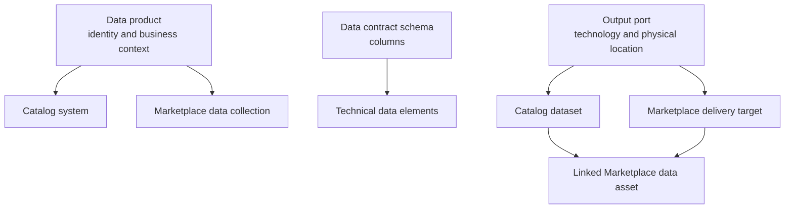

# Descriptor-to-Informatica Mapping

## Mapping Overview

The plugin reads a Witboost Data Product Descriptor and derives both the technical Catalog representation and the business Marketplace representation.



## Core Fields

| Descriptor field | Required for publication | Informatica result | Configuration decision |
| --- | --- | --- | --- |
| `id`, `name`, `description`, `version` | Yes | Data-product identity in Catalog and Marketplace | Keep stable across updates. |
| `environment` | Yes | Controls environment-specific validation and optional publication gate | Align values with the organization's deployment environments. |
| `specific.publishToInformatica` | Yes | Enables publication of the data product | Set explicitly to `true`. |
| `specific.company`, `specific.businessDomain`, `specific.businessSubdomain` | Required when category validation is enabled | Marketplace category hierarchy | The values must already exist in the tenant hierarchy. |
| `specific.customAttributes` | No | Marketplace custom attributes | Map only attributes approved for the tenant. |
| `components[].technology` | Yes for published outputs | Catalog source selection and Marketplace delivery-template lookup | Use a technology that has a configured Catalog source and delivery template. |
| `components[].shoppable` | No | Controls Marketplace delivery target and linked asset creation | Set `true` only for outputs intended for discovery and consumption. |
| `components[].specific.publishToInformatica` | No | Excludes an individual output from publication when `false` | Use for temporary or non-governed outputs. |
| `components[].specific.systemName`, `databaseName`, `schemaName`, `entityName`, `entityType` | Yes for technical Catalog metadata | Physical system and dataset location | Match the source as it exists in Informatica. |
| `components[].dataContract.schema[]` | Recommended; required for column-level metadata | Technical data elements | Keep names and types aligned with the physical schema. |

Only components representing output ports or data assets are published. Other descriptor components can coexist in the data product without creating Informatica assets.

## Catalog and Marketplace Semantics

| Descriptor shape | Catalog result | Marketplace result |
| --- | --- | --- |
| Data product | System | Data collection |
| Output port without child output ports | Dataset | Delivery target and linked asset only when shoppable |
| Output port with child output ports | System containing child datasets | Each node is evaluated independently for shoppability |
| Schema column | Technical data element, in schema order | Available through the linked Catalog asset |

`shoppable` affects Marketplace publication only. A non-shoppable output can still be published to the Catalog when all publication controls allow it.

## Tenant-Configurable Choices

The following settings belong in `src/main/resources/application.yml` and should be agreed with the tenant administrator.

| Setting | Purpose | Customer decision |
| --- | --- | --- |
| Descriptor paths | Adapts field locations and output-port identification to the descriptor convention | Keep the defaults unless the descriptor schema differs. |
| Category mapping | Maps ordered descriptor fields to Marketplace categories | Select the business hierarchy used for marketplace navigation. |
| Custom-attribute mapping | Maps descriptor values to Marketplace custom attributes | Configure only existing tenant attributes and define required/default behavior. |
| Catalog-source mapping | Associates an output-port technology with a Catalog source | Create and maintain a mapping for every published technology. |
| Metadata synchronization | Controls synchronization before validation | Enable when the Catalog source must be refreshed before checks. |
| Validation level | Chooses the depth of Informatica checks | Use `LOW`, `MID`, or `HIGH` according to release confidence needs. |

Category and custom-attribute mappings use paths relative to the data-product root. Output-port paths are relative to the output port currently being processed.

## Required Informatica Setup

For each technology and consumer-facing output, ensure the tenant contains:

- A Catalog source associated with the physical platform.
- A Catalog asset that can represent the declared physical location.
- A Marketplace delivery template with the expected technology and exposure mode.
- Marketplace categories matching the mapped descriptor values.
- Any custom attributes referenced by the mapping.

Custom-attribute and category identifiers are resolved from the tenant at runtime. Customers configure attribute names and descriptor paths; they do not need to hardcode internal tenant identifiers in descriptors.

## Example

The following anonymized descriptor publishes a single Snowflake output and makes it discoverable in Marketplace.

```yaml
id: urn:example:data-product:orders:1
kind: dataproduct
name: Orders
description: Curated order data for analytics
version: 1.0.0
environment: production
specific:
  publishToInformatica: true
  company: Example Organization
  businessDomain: Commercial
  businessSubdomain: Orders
  customAttributes:
    businessOwner: Orders Team
components:
  - id: urn:example:output-port:orders:1
    kind: outputport
    name: Orders table
    description: Daily curated orders
    version: 1.0.0
    technology: snowflake
    shoppable: true
    specific:
      systemName: Analytics
      databaseName: ANALYTICS
      schemaName: CURATED
      entityName: ORDERS
      entityType: table
    dataContract:
      schema:
        - name: order_id
          description: Stable order identifier
          dataType: string
        - name: order_date
          description: Order creation date
          dataType: date
```

The corresponding tenant configuration establishes category, custom-attribute, and Catalog-source choices:

```yaml
informatica:
  marketplace:
    mapping:
      categories:
        - descriptor-path: specific.company
        - descriptor-path: specific.businessDomain
        - descriptor-path: specific.businessSubdomain
      custom-attributes:
        Business Owner:
          descriptor-path: specific.customAttributes.businessOwner
          required: true
  data-catalog:
    catalog-source:
      sources:
        snowflake: EXAMPLE_SNOWFLAKE_CATALOG_SOURCE
    validation-level:
      level: MID
      by-environment:
        production: HIGH
```

With this configuration, the data product becomes a Catalog system and a Marketplace collection. The output becomes a Catalog dataset and, because it is shoppable, a Marketplace delivery target with a link to its Catalog asset.

## Choosing a Configuration

Choose `shoppable: true` only for outputs that should appear as consumer-facing delivery options. Configure a Catalog source whenever a technology must be checked or synchronized. Choose `MID` validation when the tenant should confirm source and asset existence, and `HIGH` when declared columns must match the catalogued schema before release.

Do not use a descriptor to carry service-account credentials, tenant identifiers, or manual Informatica asset identifiers. Those are deployment and tenant-administration concerns.