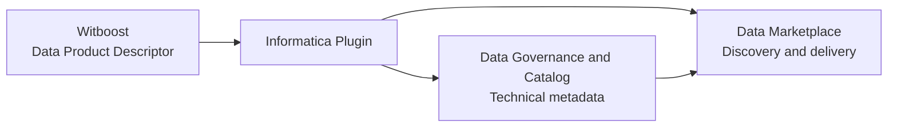
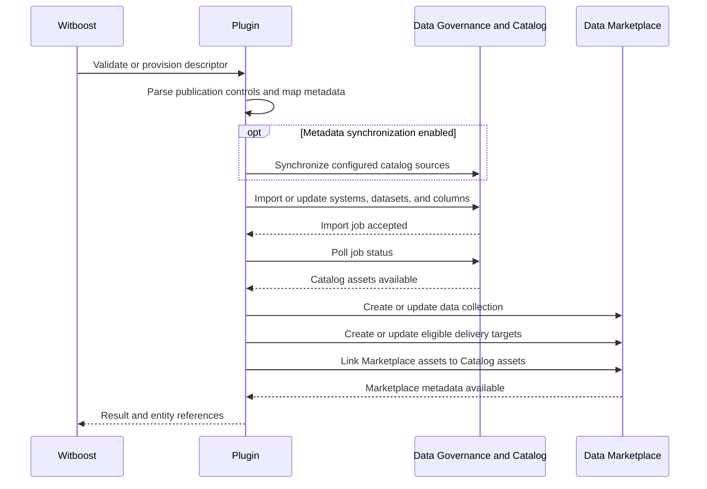

# High-Level Design

## Purpose

The plugin connects the Witboost data-product lifecycle to Informatica. It receives a Data Product Descriptor and creates, updates, validates, or removes the corresponding metadata in the Informatica tenant.

It publishes to two complementary areas:

- **Informatica Data Governance and Catalog** holds the technical representation: systems, datasets, physical locations, and technical data elements.
- **Informatica Data Marketplace** holds the business representation: data collections, delivery targets, and links to the catalogued assets.

## Lifecycle Operations

| Operation | Outcome |
| --- | --- |
| Validate | Checks descriptor consistency and, depending on the selected validation level, checks the configured Informatica resources. |
| Provision | Creates missing metadata or updates existing metadata to match the descriptor. |
| Unprovision | Removes the metadata managed by the plugin for the data product and its published outputs. |

Publication is deliberately explicit. The data product must set `specific.publishToInformatica: true`. An output port can opt out independently with `specific.publishToInformatica: false`. An optional allowed-environment setting prevents publication outside the chosen environment.

## Provisioning Flow

The Catalog publication happens before Marketplace linking. A Marketplace data asset can be linked only after its corresponding Catalog asset is available.

## Representation in Informatica

| Descriptor concept | Data Governance and Catalog | Data Marketplace |
| --- | --- | --- |
| Data product | System | Data collection |
| Flat output port | Dataset | Delivery target and linked data asset when shoppable |
| Nested output port | System with child datasets | Delivery targets and assets are evaluated per node |
| Column in the data contract | Technical data element | Supports the linked technical metadata |

Only output ports and data assets that meet the publication controls are considered. A data collection may exist without delivery targets when no output is marked as shoppable.

## Tenant Prerequisites

Before provisioning, the Informatica tenant administrator and data-product team agree on:

- **Catalog sources** for each technology used by published output ports.
- **Marketplace categories** matching the category hierarchy carried by the descriptor.
- **Delivery templates** for the technology and exposure mode required by each shoppable output.
- **Permissions** for the service account to manage Catalog and Marketplace resources.
- **Custom attributes**, where the organization needs additional Marketplace metadata.

The catalog-source, category, custom-attribute, and validation settings are configured in `src/main/resources/application.yml`; credentials and tenant-specific values should be supplied as environment variables.

## Validation Depth

Validation is cumulative. The configured default can be overridden by environment and then by a descriptor-specific value.

| Level | Checks |
| --- | --- |
| `OFF` | Parses the descriptor only. |
| `LOW` | Adds structural and parameter validation. |
| `MID` | Adds Catalog source and technical-asset existence checks in Informatica. |
| `HIGH` | Adds comparison of descriptor columns with the Catalog metadata. |

Use `LOW` for isolated development, `MID` to check an integrated tenant, and `HIGH` where schema alignment is a release requirement.

## Update and Removal

Provisioning is idempotent from a user perspective: submitting a changed descriptor updates the metadata rather than creating a duplicate when the matching asset already exists. Output ports that no longer belong to the published descriptor are removed from the managed Informatica representation.

Names are generated consistently from the data-product name, technology, and exposure mode. This consistency lets Marketplace locate the Catalog asset it needs to link. Teams should treat generated Informatica names as managed identifiers rather than rename them manually.

## Operational Boundaries

The plugin manages metadata; it does not move business data, create a physical database/table, or grant consumer access to the underlying platform. Those responsibilities remain with the data platform, the Catalog source, and the tenant governance process.