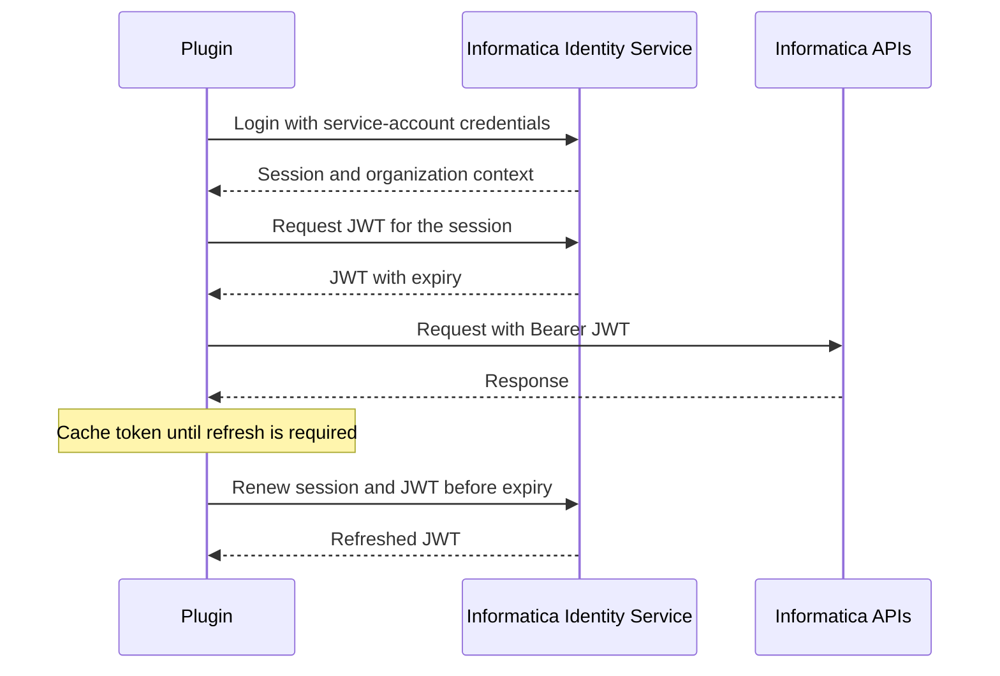

# Informatica Authentication

## Authentication Model

The plugin authenticates with an Informatica service account. It uses the account credentials to create an Informatica session, then exchanges that session for a JWT. Standard Data Governance and Catalog and Data Marketplace requests carry the JWT as a Bearer token.

Some Marketplace wrapper operations also require the Informatica session identifier and organization identifier returned at login. The plugin manages those headers as part of the same authenticated session.

The token is refreshed automatically before it expires. Credentials are not part of the descriptor and must never be exposed in documentation, logs, issue trackers, or version control.

## Identity API Calls

| API | When it is called | Purpose |
| --- | --- | --- |
| `POST /ma/api/v2/user/login` | Before the first authenticated Informatica call and when the session needs renewal | Authenticates the service account and obtains the session and organization context. |
| `POST /identity-service/api/v1/jwt/Token` | Immediately after login and when the JWT needs renewal | Exchanges the session context for the Bearer token used by the Catalog and Marketplace APIs. |

The plugin adds the session identifier to the JWT request. Standard downstream requests use `Authorization: Bearer <token>`; supported Marketplace wrapper operations also use the session and organization context returned by login.

## Local Configuration

The defaults are defined in `src/main/resources/application.yml`. Copy `.env.example` to `.env`, provide values from the organization secret manager, and load it into the shell before starting the plugin.

| Variable | Required | Purpose |
| --- | --- | --- |
| `INFORMATICA_DCMP_USERNAME` | Yes for live calls | Informatica service-account user name. |
| `INFORMATICA_DCMP_PASSWORD` | Yes for live calls | Informatica service-account password. |
| `INFORMATICA_BASE_URL` | No | Regional Identity and login endpoint. The default is the European region. |
| `INFORMATICA_DC_BASE_URL` | No | Data Governance and Catalog API endpoint. |
| `INFORMATICA_MP_BASE_URL` | No | Data Marketplace API endpoint. |
| `INFORMATICA_MP_WRAPPER_BASE_URL` | No | Marketplace wrapper endpoint used for supported integration operations. |
| `INFORMATICA_DC_UI_BASE_URL` | No | Data Governance and Catalog user-interface base URL for generated references. |

Set all regional endpoints together when using a region other than the default. Mixing URLs from different regions or organizations produces authentication or authorization failures that can resemble an invalid password.

## Service Account Requirements

Use a dedicated, non-personal account. Its permissions must permit the operations enabled for the deployment:

- Authenticate to the target Informatica organization.
- Read and manage the relevant Data Governance and Catalog assets and catalog sources.
- Read and manage Data Marketplace categories, data collections, delivery targets, templates, and linked data assets.

Apply least privilege, but do not grant an account that can authenticate without the required Catalog or Marketplace permissions: that configuration fails later during provisioning and is harder to diagnose.

## Security Practices

- Store production credentials in the deployment secret manager.
- Keep `.env` local and untracked; commit only `.env.example` with empty placeholders.
- Rotate the service-account password and revoke access when ownership changes.
- Use separate accounts or secret scopes for non-production and production tenants.
- Avoid logging request authorization headers, session identifiers, organization identifiers, or raw API responses containing them.

## Diagnosing Failures

| Symptom | Likely cause | Action |
| --- | --- | --- |
| Login rejected | Incorrect or expired service-account credentials | Validate the secret and account status with the tenant administrator. |
| Login succeeds but API calls fail | Endpoint belongs to a different region or organization | Align all configured base URLs with the target tenant. |
| Calls fail after a period of successful operation | Token cannot be refreshed or the account was disabled | Check service-account status and identity-service connectivity. |
| Access denied for one operation | Account lacks a Catalog or Marketplace permission | Grant the minimum permission required for that resource type. |

For the vendor request and response contract, consult the linked Informatica API references from the repository README.