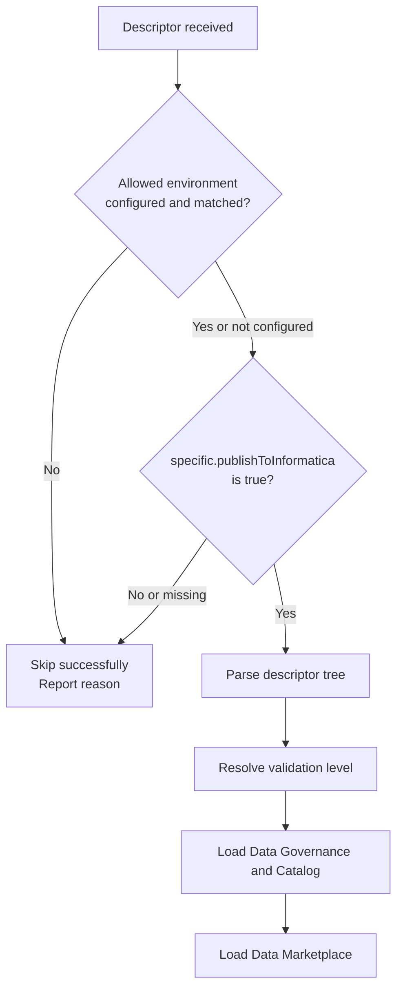
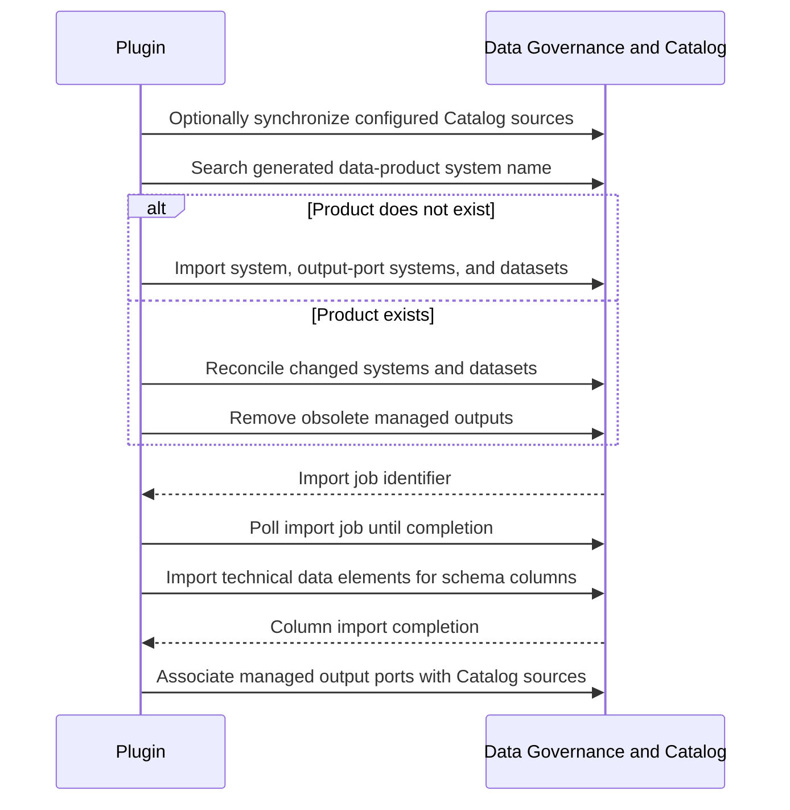
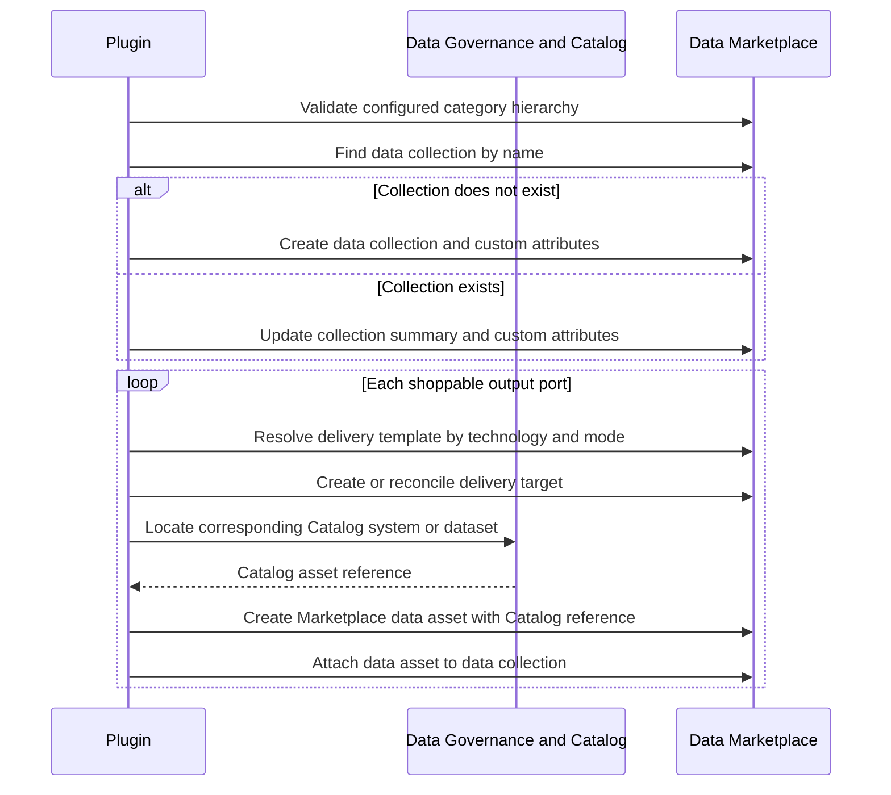

# Low-Level Design

## Scope

This guide explains the runtime behavior behind a provisioning request: when the plugin intentionally does nothing, how it loads Data Governance and Catalog assets, how it loads Data Marketplace metadata, and why Catalog sources matter.

The plugin manages metadata. It does not create a physical database, table, view, or file, and it does not copy business data.

## Request Decision Flow

## When a Descriptor Is Not Published

A skipped publication is intentional and is reported as a successful no-op rather than an Informatica error. A data product is not published when one of these conditions applies:

| Condition | Result |
| --- | --- |
| `specific.publishToInformatica` is missing | The whole descriptor is skipped. |
| `specific.publishToInformatica` is `false` | The whole descriptor is skipped. |
| An allowed environment is configured and `environment` does not match it | The whole descriptor is skipped. |
| The plugin cannot read the descriptor well enough to evaluate the publication setting | The whole descriptor is skipped. |
| An output port sets `specific.publishToInformatica: false` | The data product can be published, but that output port is excluded. |
| An output port is not shoppable | It can still be loaded in Catalog, but no Marketplace delivery target or data asset is created for it. |

The data-product publication flag is an opt-in. The output-port publication flag is an opt-out: an output port without the flag remains eligible.

Skipping is different from failure. A descriptor that passes the publication decision can still fail validation or provisioning because of missing required metadata, unavailable Informatica resources, missing permissions, category mismatches, or import-job errors.

## Validation and Pre-flight Checks

The plugin resolves validation depth in this order: descriptor-specific override, environment-specific setting, then global default.

| Level | Behavior |
| --- | --- |
| `OFF` | Parses and maps without structural or live tenant checks. |
| `LOW` | Validates descriptor structure and mapped parameters. |
| `MID` | Adds Catalog-source synchronization and checks that the declared technical assets exist in Informatica. |
| `HIGH` | Adds a comparison between declared columns and the Catalog metadata. |

At `MID` and `HIGH`, the plugin synchronizes configured Catalog sources before live checks so that the validation sees the latest discovered technical metadata.

## Informatica API Calls

The plugin uses several Informatica APIs during a normal lifecycle. Endpoint paths below are relative to the configured Informatica base URL. They are provided to make the integration observable and supportable; teams should use the vendor API references for request and response schemas.

### Data Governance and Catalog

| API | When it is called | Purpose |
| --- | --- | --- |
| `POST /data360/executable/v1/catalogsource/{sourceId}` | Before live validation and, when enabled, before Catalog loading | Starts metadata extraction for a configured Catalog source. |
| `POST /data360/search/v1/assets` | During validation, create/update reconciliation, Marketplace asset creation, and removal | Searches for systems, datasets, Catalog sources, and technical metadata. |
| `POST /data360/content/import/v1/assets` | During Catalog create or update, once for structural assets and once for columns | Uploads the metadata import that creates or updates systems, datasets, and technical data elements. |
| `GET /data360/observable/v1/jobs/{jobId}` | After a Catalog-source synchronization or metadata import starts | Polls the asynchronous job until it completes or fails. |
| `POST`, `PATCH`, or `DELETE /data360/content/v1/assets` | During managed-asset reconciliation and source relationships | Manages individual assets and their relationships, including obsolete assets. |

### Data Marketplace

| API | When it is called | Purpose |
| --- | --- | --- |
| `GET /api/v2/categories` | Validation and provisioning when category validation is enabled | Verifies that the descriptor's configured category hierarchy exists. |
| `GET`, `POST`, `PATCH`, or `DELETE /api/v2/data-collections` | Every Marketplace create, update, lookup, or removal | Manages the Marketplace representation of the data product. |
| `GET /api/v1/integration/model/customAttributes` | Before creating or updating Marketplace custom attributes | Resolves tenant-defined custom-attribute names to the identifiers required by Marketplace. |
| `GET /api/v1/integration/provisioning/deliveryTemplates` | For each shoppable output port | Resolves the delivery template for the output technology and exposure mode. |
| `GET`, `POST`, `PATCH`, or `DELETE /api/v2/delivery-targets` | When shoppable outputs are created, changed, or removed | Manages consumer-facing delivery targets. |
| `GET /api/v1/integration/dataAssets` | During Marketplace update and removal | Retrieves existing Marketplace data assets for reconciliation. |
| `POST /active-bpel/rt/Marketplace_Create_DataAssets` | For each new shoppable output port after its Catalog asset is found | Creates the Marketplace data asset with a reference to the Catalog asset. |
| `POST /active-bpel/rt/Marketplace_Update_DataAssets` | When an existing Marketplace data asset must be changed | Updates supported data-asset metadata. |
| `POST /active-bpel/rt/Marketplace_Delete_DataAssets` | When a managed Marketplace data asset is removed | Removes the Marketplace data asset. |

The order is significant: Catalog search and import APIs must make the target system or dataset available before the Marketplace data-asset creation API can reference it.

## Data Governance and Catalog Loading

The Catalog load is an upsert: the plugin searches for the generated data-product system name and either creates it or reconciles the existing representation.

The import is intentionally split into two phases:

1. The first phase imports the data-product system and the output-port systems or datasets.
2. The second phase imports technical data elements, which represent the schema columns and their associations with datasets.

Import jobs are asynchronous. The plugin waits for each job before continuing, preventing Marketplace from looking for Catalog assets that are not yet available.

In non-strict validation modes, a technical-data-element import failure can leave systems and datasets registered while column associations are incomplete. At `HIGH`, column import failure is fatal, because schema consistency is the explicit contract of that level.

On update, the plugin compares the intended output-port systems and datasets with the managed Catalog assets. It creates new assets, updates retained assets, and removes managed assets that no longer appear in the descriptor.

## Why Catalog Sources Matter

A Catalog source is Informatica's connection to a physical technology or metadata-extraction process, such as a Snowflake, BigQuery, or database source. It discovers the physical technical metadata that the plugin needs to validate and reference.

The Catalog-source mapping associates the descriptor `technology` with the corresponding source configured in the tenant. This is important for three reasons:

- **Fresh validation:** synchronization refreshes discovered metadata before `MID` and `HIGH` checks.
- **Physical verification:** the plugin can confirm that the declared database, schema, table, and, at `HIGH`, the columns correspond to what Informatica knows.
- **Traceability:** managed output ports can be associated with the source that represents their physical origin.

Configure a Catalog source for every technology that needs live validation or source association. Keep metadata synchronization enabled when the tenant must discover recent physical-schema changes before a provisioning run. It can be disabled when source refresh is managed independently, but then validation may use stale Catalog metadata.

Configure the technology-to-source mapping and synchronization option in `src/main/resources/application.yml`. An empty or unknown mapping cannot provide physical verification for that technology.

## Data Marketplace Loading

Marketplace publication uses the same mapped data product but applies consumer-facing rules. The data collection represents the data product; only shoppable output ports produce delivery targets and Marketplace data assets.

Before loading Marketplace, the configured category hierarchy is checked against the tenant when category validation is enabled. Category values must therefore be aligned between the descriptor and the Marketplace taxonomy.

For each shoppable output port, the plugin resolves a delivery template based on its technology and exposure mode. The expected template must already exist in the tenant. The plugin then searches Catalog for the generated system or dataset name and uses the Catalog asset reference when creating the Marketplace data asset. If the Catalog asset is absent, Marketplace asset creation cannot complete for that output.

## Custom Attributes and Categories

Marketplace custom attributes are tenant-defined. The configuration maps a descriptor path to a named tenant attribute; the plugin resolves the tenant's internal identifier at runtime. This keeps internal identifiers out of descriptors and allows different tenants to use different attribute definitions.

Categories work similarly at a business level: the configured descriptor fields form an ordered hierarchy, normally company, business domain, and business subdomain. The hierarchy must be created in Marketplace before validation or provisioning.

## Operational Consequences

| Change | Expected result |
| --- | --- |
| Set the root publication flag to `false` | No Catalog or Marketplace action is taken. |
| Set an output-port publication flag to `false` | That output is removed from the intended managed representation on reconciliation. |
| Change an output physical location | Catalog metadata is reconciled; use `HIGH` to enforce column alignment. |
| Set `shoppable` to `false` | Catalog metadata remains eligible; Marketplace delivery representation is not created for the output. |
| Remove an output from the descriptor | Its managed Catalog representation is removed during update reconciliation. |
| Change technology | Ensure the new Catalog source and Marketplace delivery template exist before provisioning. |

Use `HIGH` validation in controlled releases, after source extraction has completed. Use `LOW` for local development that cannot contact Informatica, and `MID` when checking live technical-asset availability is sufficient.